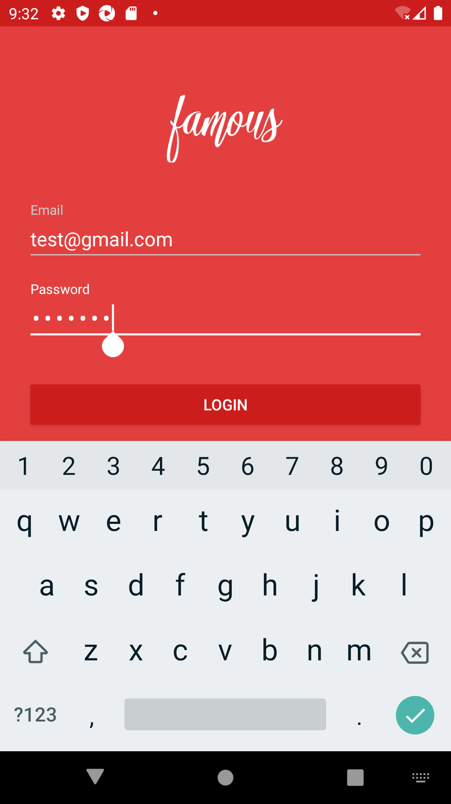

# Sample project for Mobile testing using Appium, Java, TestNG and Maven
This project uses page object factory pattern to avoid tests being too sensitive to UI changes.
This project uses data driven approach in order to keep data separate from functional test logic and to aid with quick scaling.
This project uses testNG test framework for its sophisticated features such as html run reports, ability to group and prioritize tests, parallel testing, data parameterization.
This project is built using maven tool for its simplicity of use w.r.t downloading dependencies and building the project.

## PreRequisite

- JAVA SDK latest version
- Android studio with emulator and devices created in it.
- Run a device from android emulator
- Set environment variable ANDROID_HOME, JAVA_HOME
- Start appium server in local

## How to run
- Import the project as Maven project in eclipse
- Open src/main/java/materialLogin/MaterialLoginSignInTest.java
- Right click the file and Run as> TestNG Test

## What this project does
- Loads the app MaterialLoginExample.apk
- Enters email and password.
- Clicks Login button
- Validates that home page is displayed
- Exits

## Test run results - testng html report

## test flow screenshots

